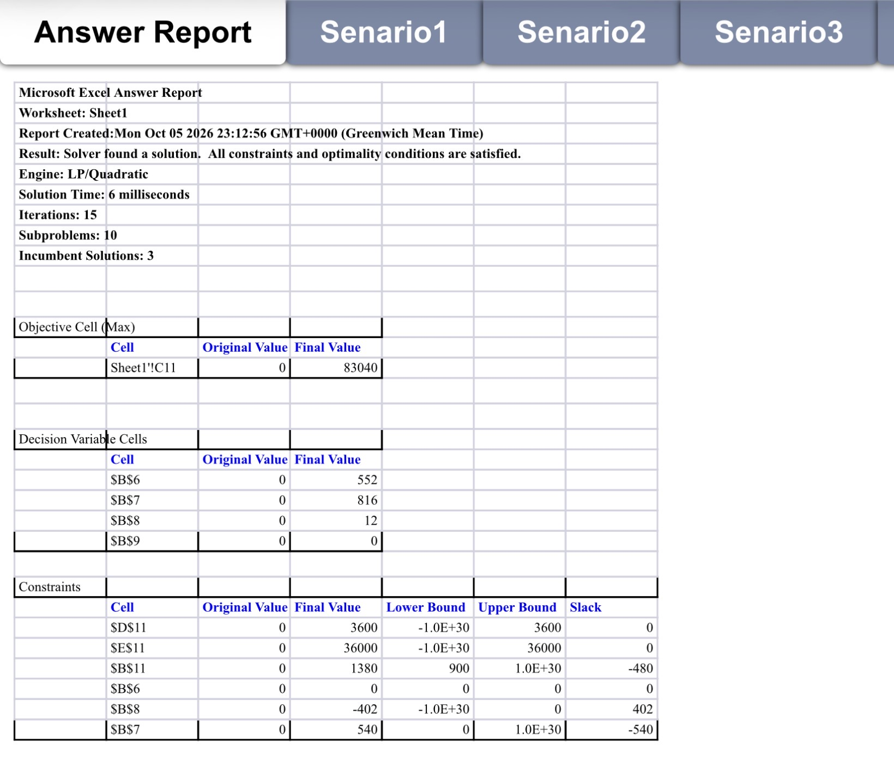
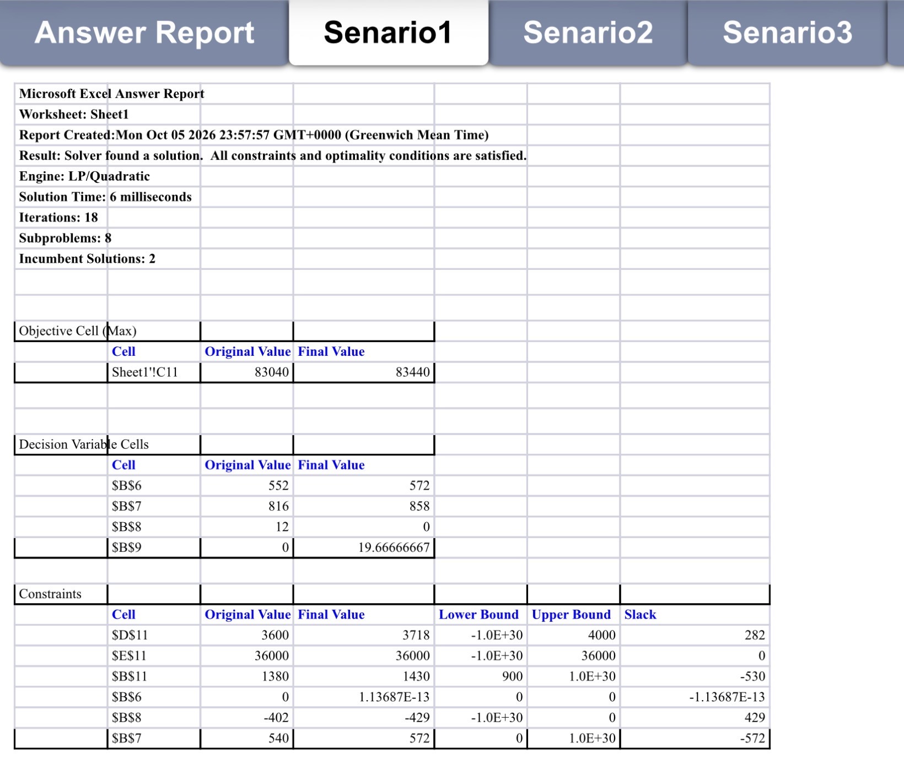
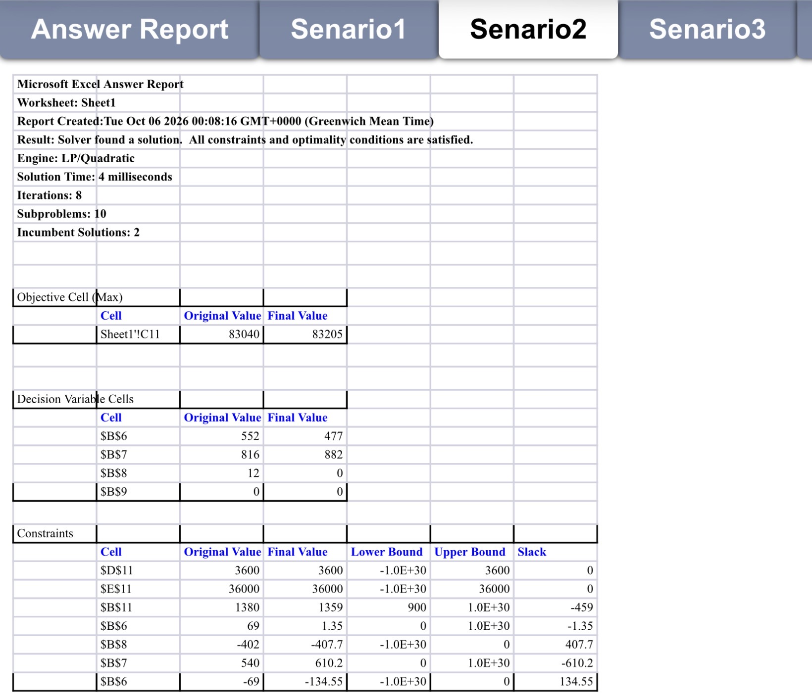
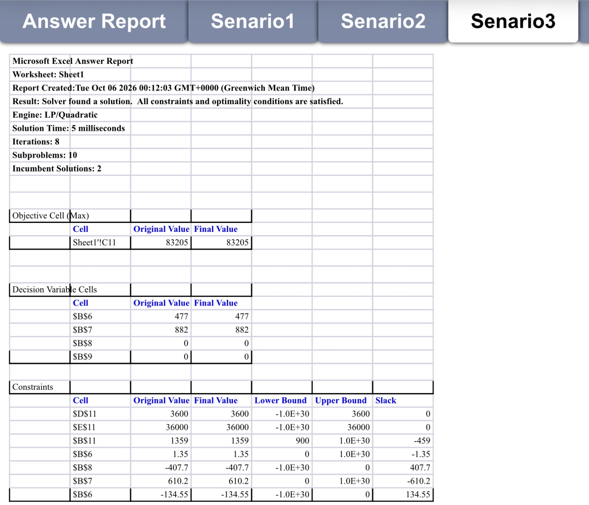
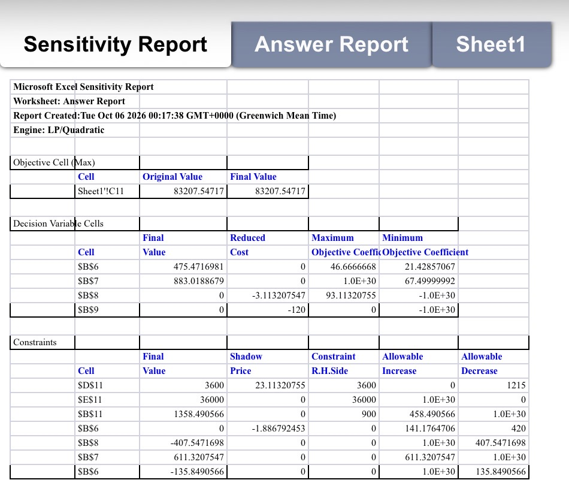

<p align="center">
  
</p>
<div align="center">


### Production & Capacity Optimization

**Turning production constraints into profitable decisions.**


**Overview · Mathematical Model · Optimization · Scenario Analysis · Sensitivity · Recommendation**

</div>

---

## ✦ Overview

**AeroPack** is a self-directed production optimization case study exploring how mathematical modeling can support real-world business decisions.

The case models a fictional backpack manufacturer producing three products:

- Urban Backpack
- Travel Backpack
- Executive Tech Bag

The objective is to determine the weekly production plan that **maximizes net profit** while accounting for limited fabric, production time, overtime capacity, contractual requirements, and product-mix policies.

The project combines **Linear Programming, Excel Solver, What-If Analysis, and Sensitivity Analysis** to move from a business problem to a quantitative management recommendation.

> **Core Question**  
> How should AeroPack allocate its limited production resources to maximize weekly profitability?

---
## 📁 Project Files

Explore the complete optimization models:

- 📊 **[Integer Optimization Model](AeroPack_Integer_Optimization.xlsx)** — Base model, Solver solution & What-If scenarios.
- 📈 **[LP & Sensitivity Analysis](AeroPack_LP_Sensitivity_Analysis.xlsx)** — LP relaxation & sensitivity report.

---
## ◈ Business Problem

AeroPack must determine how many units of each backpack model should be produced every week.

Production is limited by:

- **3,600 meters of fabric**
- **36,000 minutes of regular production time**
- **20 available overtime hours**

Using overtime costs **SAR 120 per hour**.

Management must also satisfy minimum-production, contractual, and product-mix requirements.

The challenge is therefore not simply to produce as many units as possible, but to find the **most profitable allocation of limited resources**.

---

## ▦ Model Data

| Product | Profit / Unit | Fabric | Production Time |
|---|---:|---:|---:|
| Urban Backpack | SAR 45 | 2 m | 20 min |
| Travel Backpack | SAR 70 | 3 m | 30 min |
| Executive Tech Bag | SAR 90 | 4 m | 40 min |

### Capacity & Policy

| Requirement | Value |
|---|---:|
| Fabric Capacity | 3,600 m |
| Regular Production Time | 36,000 min |
| Maximum Overtime | 20 h |
| Overtime Cost | SAR 120 / h |
| Minimum Total Production | 900 units |
| Minimum Travel Contract | 150 units |
| Urban Share | Exactly 40% |
| Executive Share | ≤ 30% |
| Travel Share | ≥ 20% |

---

## ◇ Decision Variables

Let:

`X₁` = Urban Backpacks produced  
`X₂` = Travel Backpacks produced  
`X₃` = Executive Tech Bags produced  
`X₄` = Overtime hours used  
`X₅` = Total weekly production

Production quantities are non-negative integers, while overtime may be continuous.

---

## ∑ Mathematical Model

### Objective Function

The objective is to maximize weekly net profit:

```text
Max Z = 45X₁ + 70X₂ + 90X₃ − 120X₄
```

### Subject to

**Fabric Capacity**

```text
2X₁ + 3X₂ + 4X₃ ≤ 3600
```

**Production Time**

```text
20X₁ + 30X₂ + 40X₃ − 60X₄ ≤ 36000
```

**Overtime Capacity**

```text
X₄ ≤ 20
```

**Minimum Production**

```text
X₅ ≥ 900
```

**Total Production**

```text
X₁ + X₂ + X₃ − X₅ = 0
```

**Urban Product-Mix Policy**

```text
X₁ = 0.40X₅
```

**Executive Product-Mix Policy**

```text
X₃ ≤ 0.30X₅
```

**Travel Product-Mix Policy**

```text
X₂ ≥ 0.20X₅
```

**Contract Requirement**

```text
X₂ ≥ 150
```

---

## ⚙️ Excel Solver Implementation

The model was implemented in **Microsoft Excel** and optimized using **Excel Solver**.

`SUMPRODUCT` was used to calculate the objective function and total resource consumption.

Solver was configured to:

- maximize weekly net profit,
- change the production and overtime decision variables,
- enforce resource and policy constraints,
- maintain non-negativity,
- and enforce integer production quantities.

---

# ◉ Optimal Production Plan
<p align="center">
  
</p>
| Metric | Optimal Result |
|---|---:|
| **Maximum Weekly Profit** | **SAR 83,040** |
| **Total Production** | **1,380 units** |
| Urban Backpacks | 552 |
| Travel Backpacks | 816 |
| Executive Tech Bags | 12 |
| Overtime Used | **0 h** |

The optimal integer solution recommends producing:

**552 Urban Backpacks**  
**816 Travel Backpacks**  
**12 Executive Tech Bags**

for a total of **1,380 units per week**.

This production plan generates a maximum weekly net profit of:

<div align="center">

## **SAR 83,040 / week**

</div>

No overtime is required in the optimal base solution.

---

## ▣ Resource Utilization

| Constraint | Actual | Limit | Status |
|---|---:|---:|---|
| Fabric | 3,600 m | 3,600 m | **Binding** |
| Production Time | 36,000 min | 36,000 min | **Binding** |
| Overtime | 0 h | ≤ 20 h | Non-binding |
| Total Production | 1,380 | ≥ 900 | Non-binding |
| Urban Share | 40% | = 40% | **Binding** |
| Executive | 12 | ≤ 414 | Non-binding |
| Travel Share | 816 | ≥ 276 | Non-binding |
| Travel Contract | 816 | ≥ 150 | Non-binding |

Both fabric and regular production time are fully utilized in the original solution.

However, a binding constraint is not automatically the most economically valuable resource. Scenario and sensitivity analyses are used to investigate that question.

---

# ↗ What-If Analysis

Three management alternatives were tested independently against the original solution.

| Scenario | Weekly Profit | Change | Insight |
|---|---:|---:|---|
| Original | SAR 83,040 | — | Current optimum |
| **More Fabric** | **SAR 83,440** | **+ SAR 400** | **Best tested improvement** |
| More Overtime | SAR 83,040 | SAR 0 | No benefit alone |
| Flexible Product Mix | SAR 83,205 | + SAR 165 | Better mix improves profit |

---

### 01 — Additional Fabric

Fabric capacity was increased from:

```text
3,600 m → 4,000 m
```

The new optimal solution was:

| Decision | Result |
|---|---:|
| Urban | 572 |
| Travel | 858 |
| Executive | 0 |
| Overtime | 19.67 h |
| Total Production | 1,430 |
| **Weekly Profit** | **SAR 83,440** |

Weekly profit increased by:

### **+ SAR 400**

This was the **largest profit improvement among the tested scenarios**.

Interestingly, only **3,718 of the available 4,000 meters** of fabric are used in the new solution.

This indicates that after fabric capacity is expanded, another production constraint begins limiting further improvement.

---
<p align="center">
  
</p>

### 02 — Additional Overtime

Maximum overtime capacity was increased from:

```text
20 h → 30 h
```

Fabric capacity was restored to the original **3,600 meters** before solving the scenario.

The optimal solution remained unchanged.

```text
Weekly Profit = SAR 83,040
Profit Change = SAR 0
```

> Increasing overtime capacity alone provides no economic benefit under the current resource conditions.

---
<p align="center">
  
</p>

### 03 — Flexible Product Mix

The original requirement:

```text
Urban Share = 40%
```

was relaxed to:

```text
35% ≤ Urban Share ≤ 45%
```

The resulting production plan was:

| Decision | Result |
|---|---:|
| Urban | 477 |
| Travel | 882 |
| Executive | 0 |
| Overtime | 0 h |
| Total Production | 1,359 |
| **Weekly Profit** | **SAR 83,205** |

Weekly profit increased by:

### **+ SAR 165**

while total production decreased from **1,380 to 1,359 units**.

> **More production does not necessarily mean more profit.**  
> A more profitable product mix can outperform a higher-volume production plan.

<p align="center">
  
</p>
---

# ⌁ Sensitivity Analysis

A separate **continuous LP relaxation** was created by removing the integer restrictions from production quantities.

This distinction is important:

> The integer model provides the implementable production plan.  
> The LP relaxation provides marginal economic and sensitivity insights.

The LP relaxation produced an objective value of approximately:

### **SAR 83,207.55**

with:

| Variable | LP Solution |
|---|---:|
| Urban | ≈ 475.47 |
| Travel | ≈ 883.02 |
| Executive | 0 |
| Overtime | 0 |

---
<p align="center">
  
</p>

## Shadow Price

For the fabric constraint:

```text
Final Value        = 3600
RHS                = 3600
Shadow Price       ≈ 23.1132
Allowable Increase = 0
Allowable Decrease = 1215
```

The positive shadow price indicates that **fabric is an economically valuable resource at the LP optimum**.

Within the valid sensitivity range, a one-unit change in the fabric RHS corresponds to an approximately **SAR 23.11 change in the optimal objective value**.

However:

```text
Allowable Increase = 0
```

Therefore, the current shadow price should **not** be used to predict the impact of increasing fabric beyond 3,600 meters.

The actual What-If scenario is used instead when evaluating additional fabric capacity.

---

### Production Time

For regular production time:

```text
Final Value        = 36000
RHS                = 36000
Shadow Price       = 0
Allowable Increase = 1E+30
Allowable Decrease = 0
```

`1E+30` represents an effectively unlimited increase for practical sensitivity interpretation.

The zero shadow price indicates that additional production-time capacity alone has **no marginal economic value** at this LP solution.

---

## Reduced Cost

For the Executive Tech Bag:

```text
Final Value                  = 0
Reduced Cost                 ≈ −3.1132
Current Objective Coefficient = 90
Maximum Objective Coefficient ≈ 93.1132
```

Because Executive production is zero in the LP optimum, its reduced cost tells us how much its unit contribution must improve before it becomes attractive to enter the optimal solution.

Its profit contribution would need to increase by approximately:

```text
SAR 3.11
```

from:

```text
SAR 90 → approximately SAR 93.11
```

assuming the relevant sensitivity conditions remain valid.

---

## Allowable Increase & Decrease

Allowable Increase and Allowable Decrease define the range over which the current sensitivity information remains valid.

For a constraint:

```text
Lower Limit = RHS − Allowable Decrease
Upper Limit = RHS + Allowable Increase
```

For fabric:

```text
RHS = 3600
Allowable Decrease = 1215
Allowable Increase = 0
```

Therefore:

```text
Lower Limit = 3600 − 1215 = 2385
Upper Limit = 3600 + 0 = 3600
```

giving:

```text
2385 ≤ Fabric RHS ≤ 3600
```

within which the reported shadow-price relationship remains valid.

---

# ✦ Key Business Insights

### 01. Fabric has the strongest tested expansion value

Increasing fabric capacity produced the largest profit improvement among the three What-If scenarios.

### 02. Overtime is not automatically valuable

Increasing the overtime limit alone generated **no additional profit**.

### 03. Product-mix policies have an economic impact

Relaxing the Urban Backpack policy improved weekly profit by **SAR 165**.

### 04. More output does not always mean more profit

The flexible product-mix scenario produced **21 fewer units**, yet generated a higher weekly profit.

### 05. Binding does not automatically mean “most valuable”

Resource utilization alone is not enough to determine economic value. Scenario and sensitivity analysis provide additional managerial insight.

---

# ◆ Management Recommendation

Based on the optimization results, AeroPack should **prioritize investigating additional fabric capacity** rather than investing in additional overtime capacity.

Increasing fabric availability from **3,600 to 4,000 meters** produced the greatest improvement among the tested alternatives:

```text
SAR 83,040 → SAR 83,440
```

representing an increase of:

### **+ SAR 400 per week**

Greater product-mix flexibility also created economic value, increasing weekly profit to **SAR 83,205**, and may therefore be considered as a secondary strategy.

In contrast, increasing overtime capacity from **20 to 30 hours** produced **no improvement in weekly profit** under the current resource conditions.

> ### Decision Priority
>
> **1. Investigate additional fabric capacity**  
> **2. Consider greater product-mix flexibility**  
> **3. Do not prioritize additional overtime capacity under current conditions**

The cost of acquiring additional fabric was **not included in the model**.

Therefore, AeroPack should invest in additional fabric only when its acquisition cost is justified by the additional profit generated.

---

## 🛠️ Tools & Methods

`Microsoft Excel` · `Excel Solver` · `Linear Programming` · `Integer Programming` · `Operations Research` · `Mathematical Modeling` · `What-If Analysis` · `Sensitivity Analysis` · `Business Analytics`

---

## 📁 Repository Structure

```text
aeropack-opt/
│
├── README.md
├── AeroPack_Production_Optimization.xlsx
│
├── assets/
│   ├── aeropack-hero.png
│   ├── model.png
│   ├── solver-results.png
│   └── sensitivity-report.png
│
└── docs/
    └── AeroPack_Case_Study.pdf
```

---

## ◌ A Note From Me

I built AeroPack as a hands-on case study to explore something I really enjoy: taking a messy business problem and turning it into a model that can actually support a decision.

Instead of stopping at *“here's the optimal solution,”* I wanted to push the model a little further — change the available resources, challenge the product-mix policy, see what happens to profit, and understand **why** Solver chooses what it chooses.

AeroPack itself is fictional, but the thinking behind the project is exactly what I wanted to practice: **mathematical modeling, business analysis, and translating numbers into decisions.**

One of my favorite takeaways? Producing more doesn't always mean earning more. Sometimes **1,359 well-chosen units beat 1,380 units** — which is probably why I enjoy optimization in the first place.

And yes, I voluntarily spent time asking Excel how much a fictional backpack factory should produce.  
**Just another night somewhere in Gotham. 🦇**

---

<div align="center">

### From constraints to decisions.

*Built with Excel Solver, curiosity, and a slightly unreasonable appreciation for optimization.*

**Mathematical Modeling · Operations Research · Business Analytics**

</div>
